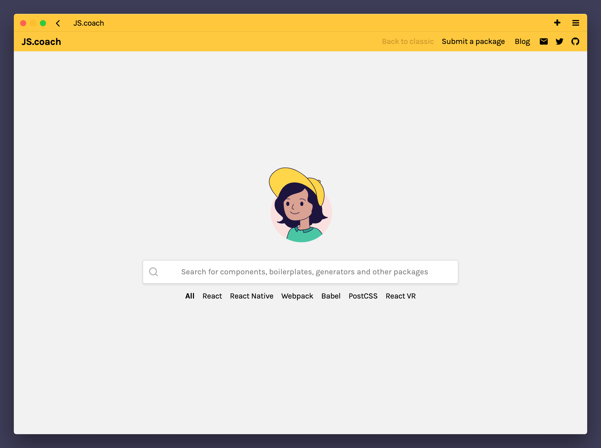
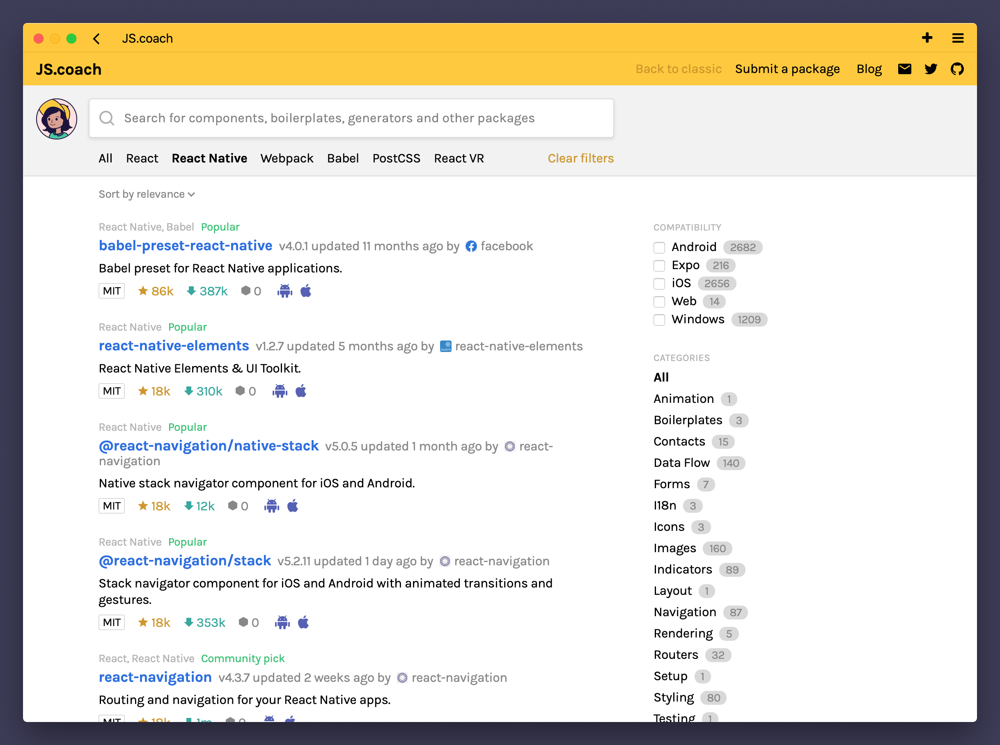
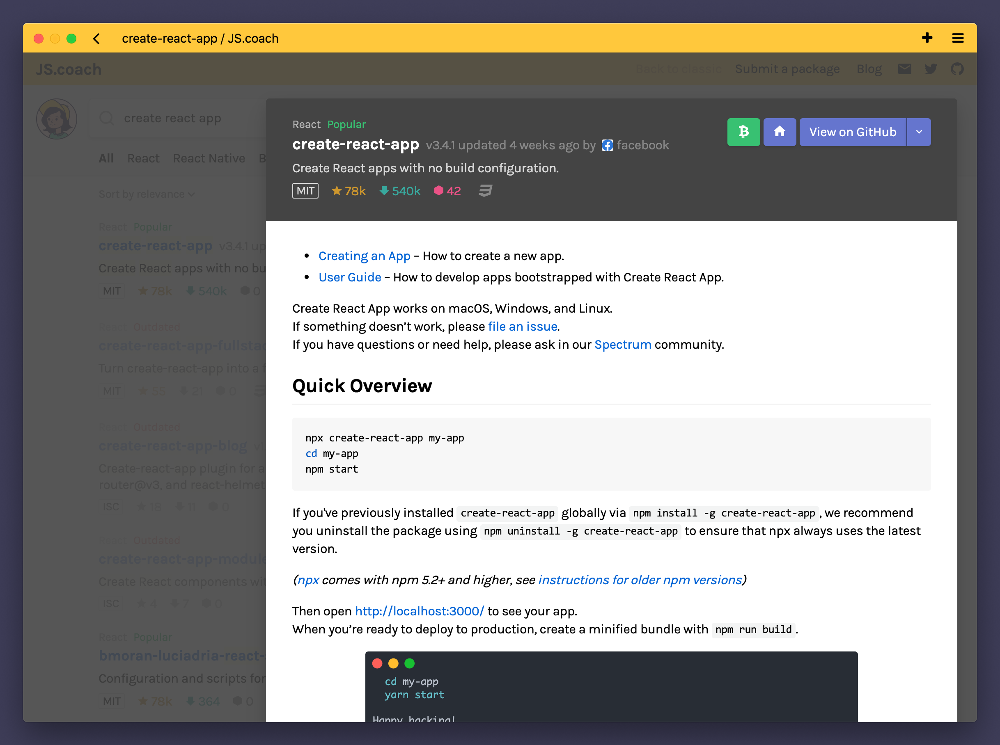

<p align="center">
  <a href="https://js.coach/">
    
  </a>
</p>

<p align="center">
  Welcome to the repository that used to power the admin interface and scheduled jobs.
</p>

---

I started JS.coach in late 2015 and maintained it somewhat actively until 2019.
It has been neglected since then but now, in 2020, the project has new maintainers.
This is an archive of the old version of the site.
You can find the active repository [here](https://github.com/jscoach/server).

<p align="center"><em>Screenshot of the welcome page:</em></p>



<p align="center"><em>Screenshot of the results page:</em></p>



<p align="center"><em>Screenshot of a package modal:</em></p>



<p align="center"><em>Part of web comic – JS coach with Space Horse and Cláudio:</em></p>


<p align="center"><em>Part of web comic – The Great Elogin appears and she wants things shipped:</em></p>


---

### Found a bug or have feedback?

Please open an issue in the [support repository](https://github.com/jscoach/support).
Feel free to submit PRs here.

### Looking for the old source?

Check out the [classic branch](https://github.com/jscoach/support/tree/classic/project).

### Setting up JS.coach

Install the [`foreman`](https://github.com/ddollar/foreman) gem.
Running `foreman start` will start the database for you and the rails server.
You can run processes individually using `foreman start web` and `foreman start postgresql`.

Credentials and other sensitive information are stored in the `.env` file.
Duplicate the existing `.env.example` file and fill the variables.
To load these variables when you run rails commands, prefix them with `foreman run`.
For example, to start the rails console type the following command:

```shell
foreman run rails c
```
